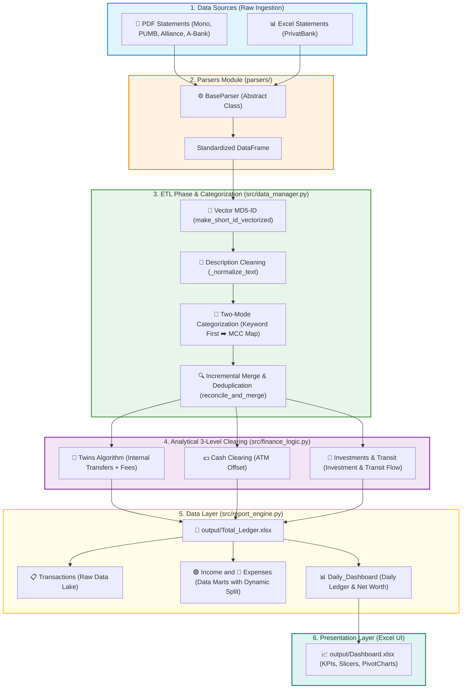
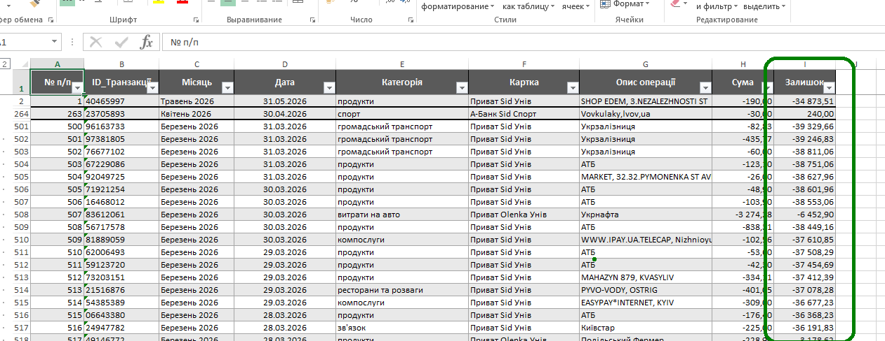

# 📊 Finance Automation & Wealth Management Tracker
    

[ 🌐 Читати українською ](Readme.md)

**Finance Automation** is a local engineering ETL pipeline (Extract, Transform, Load) designed for automatic family finance consolidation and real **Net Worth** analysis based on raw statements from Ukrainian banks. Built for personal wealth management, the system solves the chaos of handling **12+ unique cards across 5+ Ukrainian banks** (PrivatBank, Monobank, PUMB, A-Bank, Bank Alliance). Instead of a monthly manual routine of moving transactions into Excel, this Python engine parses PDF/Excel files in seconds, performs deduplication, intelligently cleanses "financial noise", and builds two-layer management reporting.

 ---

## 💻 Tech Stack
* **Programming Language:** Python 3.12
* **Data Processing & Analysis:** Pandas, NumPy
* **PDF & Excel Parsing:** `pdfplumber`, `openpyxl`, `xlrd`, `Regex`
* **Data Engineering:** MD5 Vector Hashing, `datetime` module
* **Algorithms & Financial Logic:** "Twins" Algorithm, Pandas Time-Window Matching, Dynamic Commission Splitter, FIFO Cash Clearing
* **Presentation Layer (UI):** Microsoft Excel (PivotTables, PivotCharts, Slicers, Timeline)

## 🏗 System Architecture (Data Pipeline)

## 🎯 Key Features, Goal & Business Value

### Problem Statement & Goal
When managing a personal or family budget across multiple bank cards, the primary hurdles are chaotic statement formats, double accounting during transfers between own accounts, hidden bank fees, and distorted asset balances caused by credit limits.
**Project Goal** — full automation of financial flow collection and analysis: transforming fragmented PDF/Excel files into a deduplicated database and a ready-to-use Excel management dashboard in just a few minutes.

## 💼 Business Impact & Analytical Value

* **⚡ Significant Time Savings**: Consolidating multi-month bank statements from 5 different banks (PrivatBank, Monobank, PUMB, A-Bank, Bank Alliance) takes no more than **a few minutes**.
* **📅 End-to-End Chronological Ledger**: Automatically merges transactions from **5 banks and 12 unique cards** into a single linear timeline with duplicate detection and strict temporal sorting.
* **📈 Transparent Net Worth**: Automatically accounts for bank credit limits to calculate real net asset volume in real time.
* **🧼 Financial Noise Reduction**: The intelligent "Twins" algorithm automatically finds and links internal transfers between family accounts, cleansing financial analytics from double turnover.
* **📊 Ready Management Reporting**: Automatic generation of an interactive **Daily Dashboard** with monthly sub-totals and cumulative asset balances.

---

## 📥 Primary Dataset: Parsing, Standardization & Cleaning

### 📸 Data Transformation Preview

| 📄 BEFORE: Raw Fragmented Statements | 📊 AFTER: Unified Consolidated Dataset (Data Lake) |
| :---: | :---: |
|    |  |
| *Unstructured PDF/Excel files from various banks (Monobank, PrivatBank, PUMB)* | *Standardized database with MD5 hashes, removed duplicates, and auto-categorization* |

---

### 📥 Multi-Bank Parsing Engine
The system is built on an abstract `BaseParser` class defining a unified parsing lifecycle for any bank statement (Read ➔ Identify ➔ Standardize ➔ Adjust). Custom logic is implemented for each statement type:

* **🟢 PrivatParser (Excel)** — dynamically maps variable PrivatBank columns and identifies card type via metadata.
* **🟨 MonoParser (PDF)** — extracts transaction tables, automatically detects IBAN, and adjusts credit limits from the header.
* **🔵 PumbParser (PDF)** — intelligently merges multi-line transaction descriptions (often split during PDF export) and restores exact operation timestamps.
* **🟪 AllianceParser (PDF)** — uses regular expressions (Regex) to instantly locate 4-digit card tails in technical text.
* **🟧 AbankParser (PDF)** — dynamically detects IBAN in the statement header and enforces card assignment for all transactions.

---

## 🔄 ETL Phase: Configuration, Cleansing & DataFrame Preparation

Before applying financial analytics, all information passes through an end-to-end ETL pipeline (Extract, Transform, Load) converting raw statements into a standardized data array.

#### 1. Schema & Numeric Normalization
* **Unified Column Standard (Schema)**: Every read file is coerced into a strict schema: `ID_Транзакції` (Transaction ID), `Дата` (Date), `Категорія` (Category), `Картка` (Card), `Опис операції` (Description), `Сума` (Amount), and `Залишок` (Balance).
* **Type Transformation (Float Normalization)**: Via `clean_and_transform`, all amounts and balances are stripped of thousand separators (spaces), commas are replaced with dots, and technical currency symbols are trimmed using regex `(-?\d+\.?\d*)` before converting to `float`.

#### 2. Intelligent Linguistic Description Normalization (`_normalize_text`)
Before categorization, transaction text is thoroughly cleaned of technical noise:
* Text is converted to lowercase, replacing Latin `i` with Ukrainian `і` for keyboard layout unification.
* Textual noise and filler words are removed: `uah`, `грн`, `покупка` (purchase), `оплата` (payment), `переказ` (transfer), `списання` (charge).
* Random technical digits (authorization numbers, receipt IDs) that interfere with keyword matching are stripped.
* **Contact Preservation**: Phone numbers in `+380` formats are temporarily masked under a `plusua` marker. This saves them from numeric digit stripping and turns them into a reliable `plus380` marker for mobile top-up auto-detection.

#### 3. Vectorized Transaction ID Generation (`make_short_id_vectorized`)
Since banks do not provide global transaction IDs, the system creates a deterministic 8-digit ID:
1. Constructs a unique string: `[Date YYYY-MM-DD HH:MM:SS] + " *" + [Card Name] + "* " + [Amount {:.2f}]`.
2. Encodes the string into an MD5 hash.
3. Takes the first 8 hex characters and converts them to decimal modulo $10^8$ with left zero-padding.

#### 4. Incremental Merge & Deduplication (`reconcile_and_merge`)
* Newly ingested statements may overlap existing historical periods. The system computes IDs for new rows and compares them against `Total_Ledger.xlsx`.
* Duplicate entries are filtered out, while new unique records are appended.
* The final DataFrame is re-sorted chronologically by date and time.

#### 5. Card Balance Reconstruction
* PDF credit card statements from certain banks lack per-transaction running balances.
* `apply_bank_specific_post_processing` detects such cards and automatically reconstructs the cumulative balance for each operation based on known statement opening/closing balances and transaction amounts.

#### 6. Account Identity Detection & Credit Limit Adjustments
* **Account Identity Detector (`detect_account_identity`)**: Reads statement metadata using a strict hierarchy (IBAN regex `UA` + 27 digits ➔ 4-digit card tail) to assign the correct card name and owner from config.

* **Credit Limit Adjustment**: Upon detecting bank credit limits (e.g. Monobank or Alliance), the system automatically subtracts the credit limit from the card balance. This prevents Net Worth distortion by separating bank credit lines from actual owned assets.

#### 7. Two-Mode Auto-Categorization ("Keyword First")

To prevent financial chaos and duplicate synonym categories (e.g., simultaneous existence of "groceries", "food products", or "supermarkets"), the system enforces a **strict target category list** (6 for income and 17 for expenses). All operations are forcibly categorized using the "Keyword First" algorithm:

1. **Stage 1: Keyword Search (`CATEGORIES_KEYWORDS`)** — normalized transaction description is matched against key brand markers (e.g. `atb` or `silpo` are mapped to `groceries`).
2. **Stage 2: MCC Code Lookup (`MCC_MAP`)** — if keywords are absent or ambiguous (`AMBIGUOUS_CATEGORIES` like "payment" or "transfer"), the category is determined by the Merchant Category Code (e.g. MCC `5411` ➔ `groceries`).
3. **🛡️ Fallback Logic for Unrecognized Transactions**:
    * Uncategorized expense (Amount < 0) ➔ assigned to **`other expenses`**.
    * Uncategorized income (Amount > 0) ➔ assigned to **`other income`**.

---

### 📊 Analytical Core: Flow Distribution & 3-Level Clearing Engine

After data cleansing and standardization, the analytical engine `report_engine.py` and financial logic `finance_logic.py` execute two key tasks: data flow separation and financial noise elimination.

#### 1. 📂 Data Structuring: Income and Expense Ledgers
For analytical clarity, the final Excel workbook is split into two independent chronological ledgers (sheets) operating with categories from `config.py`:

* **🟢 Income Ledger**: accumulates positive transactions (Amount > 0) across 6 categories: *salary & payouts, bonuses & cashback, cash deposits, external transfers, other income*, and technical *internal transfer (incoming)*.
* **🔴 Expenses Ledger**: contains all debit transactions (Amount < 0) across 17 expense categories, grouped by type (from *utilities* and *groceries* to technical *ATM cash withdrawals* or *internal transfers (outgoing)*).

#### 2. 🛡️ Three-Level Automatic Clearing Engine
The core engineering value of the project is mathematical modeling of actual money movement. To prevent multi-card statements from distorting real consumption analytics, the system automatically offsets counter-transactions across three levels:

##### 👥 Level 1: Internal Transfers Between Own Accounts (Twins Algorithm)
When money is transferred between accounts tracked in the system (e.g., from Serhii's card to Olenka's card), banks log two separate operations: an expense in one bank and income in another. Unadjusted, family budget turnover would be artificially inflated by this amount.
* **Solution**: The "Twins" algorithm searches for opposite transactions within a short time window. Upon a match (e.g., Olenka received the amount Serhii just sent), the system labels these operations with technical categories *internal transfer (outgoing)* / *internal transfer (incoming)*, excluding them from net consumer expense calculations.
* **🛠️ Bank Fee Handling**: Transfers are often accompanied by fees (e.g., Serhii sent `10 050.00` UAH, while Olenka received `10 000.00` UAH). A naive algorithm would fail to match these due to sum mismatch.
    * *Our Solution*: The system detects the delta, automatically splits the transfer transaction on-the-fly, isolates `50.00` UAH as *other expenses* (bank fee), and successfully links the remaining `10 000.00` UAH as a clean internal transfer. Ledger balance remains perfectly reconciled.

| 📄 BEFORE: Debit of 3065.25 and Credit of 3050.00 (Fee 15.25) | 📊 AFTER: Debit transaction split into 2: 3050.00 (transfer body) + 15.25 (bank fee) |
| :---: | :---: |
|  |  |
| *Original Transactions* | *Split Transactions (Note the matching IDs)* |

### 3.2. ATM Cash Offset (Cash Clearing & ATM-Noise Reduction)

#### ❓ Business Problem
ATM cash withdrawals and subsequent cash deposits via terminals onto another card do not constitute real consumer expenses or income. Without processing, these transactions create artificial transit turnover, inflating financial reporting numbers.

#### ⚙️ `process_cash_clearing` Logic
The `finance_logic.py` module executes automatic mutual offsetting of cash flows using **Local FIFO Priority**:

1. **Intra-Month FIFO Clearing:** Within each calendar month, ATM cash withdrawals and deposits are mutually offset strictly via FIFO up to the limit.
2. **Inter-Month Buffer (Up to the 10th):** Unused cash deposits made by the 10th of the month offset remaining cash withdrawals from the previous month.
3. **Dynamic Boundary Splitting:** A transaction landing on the limit boundary is automatically split into separate rows sharing timestamps and IDs.
4. **Unmatched Balance Allocation:** Withdrawals exceeding the offset limit are re-categorized into *`other expenses`*, while remaining deposits become *`other income`*.
5. **Raw Data First Principle:** All manipulations occur "on-the-fly" during analytical `df_analytical` generation for Daily Dashboard, keeping `Total_Ledger.xlsx` 100% untouched.

#### 📸 Cash Clearing Visual Preview

| 📄 BEFORE: Raw withdrawal/deposit transactions | 📊 AFTER: `process_cash_clearing` result |
| :---: | :---: |
|  |  |
| *ATM Cash Withdrawal of 16000.00 UAH* | *Allocation of 16000.00 UAH across deposit transactions. Transit turnover eliminated, deltas re-categorized* |

##### 🚀 Level 3: Transit Operations & "Investments" Category
* **Transit Operations**: Tracks targeted fund movement through transit accounts (e.g. term deposits, savings vaults, or temporary safes).
* **"Investments" Logic**: Large outgoing transit flows (e.g. foreign currency purchases, broker transfers, or bond purchases) are not treated as consumer burn rate (like food or clothing). Such transactions pass through a specialized filter and are classified as **`investments`** (assets). This preserves accurate monthly consumption tracking (Burn Rate) and net wealth accumulation.

---

### 📊 Analytics Module & Visual Dashboard (`report_engine.py`)

The daily analytics module transforms the consolidated transaction array into a visual daily management report following classic financial ledger architecture. The output is an interactive **Daily_Dashboard** tab in `Total_Ledger.xlsx`.

#### 1. Daily Dashboard Structure
Aggregates financial flows by calendar day and compares actual expenses against planned daily budget limits across 8 columns:
1. **Month** — calendar month and year (e.g., March 2026).
2. **Date** — specific day in DD.MM.YYYY format.
3. **Plan** — daily budget limit allocated for the family.
4. **Expenses** — total actual daily expenses (negative value or `0.00`).
5. **Income** — total actual daily income receipts.
6. **Daily Budget Variance** — net financial result of the day against the plan.
7. **Monthly Cumulative Balance** — cumulative savings or overspend balance within the current month.
8. **Net Worth / Cumulative Asset Balance** — global net worth progression accounting for initial balance and bank credit limits.

#### 2. Mathematical Calculation Model
For each calendar day, the system computes:
* **Daily Budget Variance**:
    $$\text{Daily Budget Variance} = \text{Plan} + \text{Expenses} + \text{Income}$$
    *(Since expenses are negative in DataFrame, addition computes the net variance)*.
* **Monthly Cumulative Balance**:
    Cumulative sum of daily variances within a calendar month. Resets on the 1st of each month to show intermediate budget performance:
    $$\text{Monthly Cumulative Balance}_{d} = \sum_{i=1}^{d} \text{Daily Budget Variance}_{i}$$
* **Net Worth / Cumulative Asset Balance**:
    End-to-end cumulative total from ledger inception, reflecting actual family net wealth in real time:
    $$\text{Net Worth / Cumulative Asset Balance}_{t} = \text{Initial Balance} + \sum_{i=1}^{t} \text{Daily Budget Variance}_{i}$$

#### 3. Row Grouping & Professional Styling (openpyxl)
* **Monthly Subtotal Rows**: Automatically inserts a **"TOTAL for [Month YYYY]"** summary row after each month's end. *Plan, Expenses*, and *Income* are summed, while *Monthly Cumulative Balance* and *Net Worth* capture the closing status.
* **Detail Row Grouping**: Individual transactions for each day are collapsible under Excel **"+"** outline grouping buttons inside each calendar day.
* **Dynamic Row Height & Text Wrap**: `wrap_text=True` is enabled for descriptions, with row height automatically adjusting to text length to prevent truncating long vendor names.
* **Visual Formatting**: Two-level header structure, bold monthly totals with colored fill, auto-fitted column widths, optimized for landscape printing.

---

### 📈 Data Visualization & Interactive Dashboard (`output/Dashboard.xlsx`)

For visual financial analysis, a **Decoupled Data & Presentation Layer** architecture is implemented. This separates automated Python data processing from Excel visual analytics, guaranteeing 100% preservation of formatting, custom pivot tables, and slicers.

#### 🏗 Solution Architecture:
1. **`output/Total_Ledger.xlsx` (Data Layer)** — local database (Data Lake / Marts), automatically generated and updated by Python.
2. **`output/Dashboard.xlsx` (Presentation Layer)** — interactive management dashboard containing analytical cards, charts, and slicers.

#### 📊 Key Dashboard Features:
* **KPI Cards**: highlight key financial metrics (total income, expenses, and net surplus/deficit).

* **Dynamic Slicers**: one-click interactive filtering of all charts and cards by selected months.
* **Drill-Down PivotCharts**: two-level date hierarchy (`Month` ➡️ `Date`) enabling toggling between high-level monthly trends and daily granularity.

* **PivotTable External Data Source**: pivot tables in `Dashboard.xlsx` are linked directly to column ranges in `Total_Ledger.xlsx`. New transactions processed by Python update the dashboard with a single **"Refresh All" (Data -> Refresh All)** click in Excel.

---

### 💼 Deliverables & Customization

This project serves as a complete, flexible engineering framework for family or micro-office financial consolidation and wealth analytics.

#### End-User Deliverables:
1. **🧼 Clean Data**: Fully deduplicated, chronologically structured, and linguistically normalized transaction register in Excel.
2. **📊 Executive Reporting**: Automatically generated `Daily_Dashboard` with transaction drill-down, monthly subtotals, and Net Worth tracking.
3. **🛡️ Data Security**: Runs 100% locally — zero financial or personal data is transmitted to external cloud services.

#### 🔧 Customization Capabilities:
Modular architecture allows easy adaptation:
* **New Bank Integration**: Quick onboarding of statement formats for any financial institution worldwide (requires inheriting `BaseParser`).
* **Custom Category Tree**: Full customization for personal or small business chart of accounts.
* **Business Rule Configuration**: Flexible tuning of Twins transfer matching, credit limits, and daily expenditure targets.

---

### 📞 Let's Connect!

Looking for an automated solution to consolidate personal/family finances, cleanse unstructured banking data, or automate Excel management reporting? I'm available for engineering projects of any complexity!

* **💻 Upwork Profile:** [Order Development on Upwork](https://upwork.com/freelancers/your-profile)
* **🤝 LinkedIn:** [Connect on LinkedIn]
* **📧 Email:** [sid78rivne@gmail.com]
* **🐙 GitHub:** [https://github.com/Serhii-Sid]
