# 📊 Finance Automation &amp; Wealth Management Tracker
    

[ 🌐 Read in English ](README_EN.md)

**Finance Automation** — це локальний інженерний ETL-конвеєр (Extract, Transform, Load) для автоматичної консолідації сімейних фінансів та розрахунку реальних чистих активів (**Net Worth**) на основі сирих виписок з українських банків. Система розроблена для персонального використання та вирішує проблему хаосу при веденні бюджету з **12+ унікальних карток у 5+ банках України** (ПриватБанк, Monobank, ПУМБ, А-Банк, Банк Альянс). Замість щомісячної ручної рутини перенесення транзакцій в Excel, Python-скрипт за лічені секунди здійснює парсинг PDF/Excel файлів, дедуплікацію, інтелектуальне очищення від "фінансового шуму" та формує двошарову управлінську звітність.

 ---

## 💻 Технологічний стек (Tech Stack) 
* **Мова розробки:** Python 3.12 
* **Обробка та аналіз даних:** Pandas, NumPy
* **Парсинг PDF та Excel:** `pdfplumber`, `openpyxl`, `xlrd`, `Regex`
* **Інженерія даних:** Векторне хешування MD5, модуль `datetime`
* **Алгоритми та фінансова логіка:** Алгоритм "Twins", часові вікна Pandas (Time-Window Matching), Dynamic Commission Splitter, FIFO Cash Clearing
* **Шар презентації (UI):** Microsoft Excel (PivotTables, PivotCharts, Slicers, Timeline)

## 🏗 Загальна архітектура системи (Data Pipeline)

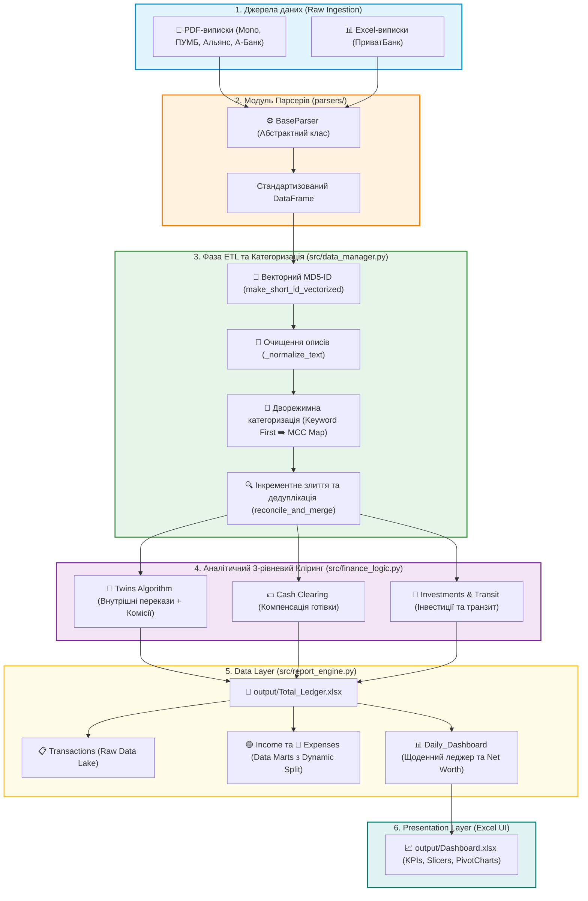

## 🎯 Загальний функціонал, мета та бізнес-цінність 

### Проблематика та мета
При веденні особистого бюджету з багатьох банківських карток головними перешкодами є хаос у форматах виписок, подвійний облік коштів при переказах між власними рахунками, приховані комісії та викривлення балансу через кредитні ліміти.
**Мета проєкту** — повна автоматизація збору та аналізу фінансових потоків: перетворення розрізнених PDF/Excel файлів у дедупліковану базу даних та готовий Excel-дашборд всього за кілька хвилин.

## 💼 Бізнес-результат та аналітична цінність

*   **⚡ Значна економія часу**: Консолідація виписок за кілька місяців з різних банків (ПриватБанк, Монобанк, ПУМБ, А-Банк, Альянс) займає не більше **кількох хвилин**.
*   **📅 Наскрізний хронологічний реєстр**: Автоматичне об'єднання транзакцій з **5 банків та 12 унікальних карт** в єдину лінійну стрічку із визначенням і відсіюванням дублікатів та суворим сортуванням за часом.
*   **📈 Наочний Net Worth (Чисті Активи)**: Автоматичний облік кредитних лімітів банків для розрахунку реального обсягу власних накопичень у реальному часі.
*   **🧼 Очищення від фінансового шуму**: Розумний алгоритм "Twins" автоматично знаходить та пов'язує внутрішні перекази між рахунками членів родини, очищаючи фінансову аналітику від подвійного обороту.
*   **📊 Готовий управлінський звіт**: Автоматична генерація інтерактивної вкладки щоденної аналітики (**Daily Dashboard**) з проміжними місячними підсумками та накопичувальним балансом.

---

## 📥 Первинний датасет: Парсинг, Стандартизація та Очищення

### 📸 Наочна трансформація даних (Data Transformation Preview)

📄 БУЛО: Сирі розрізнені виписки (Raw Statements) | 📊 СТАЛО: Єдиний консолідований датасет (Data Lake) |
| :---: | :---: |
| 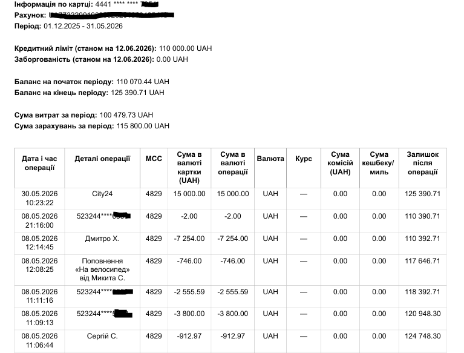 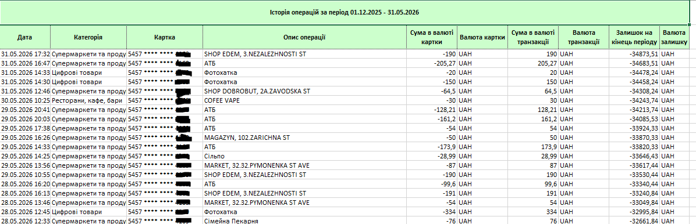 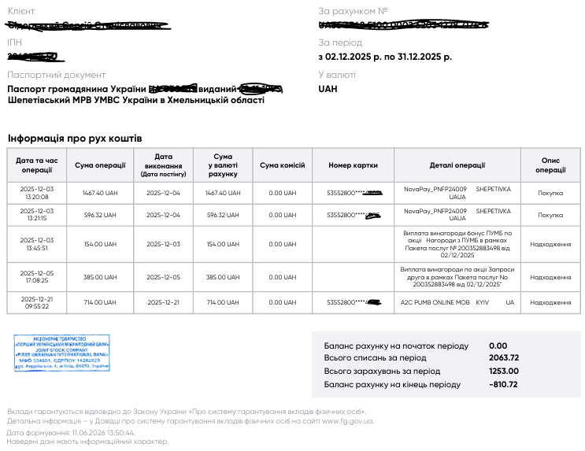 | 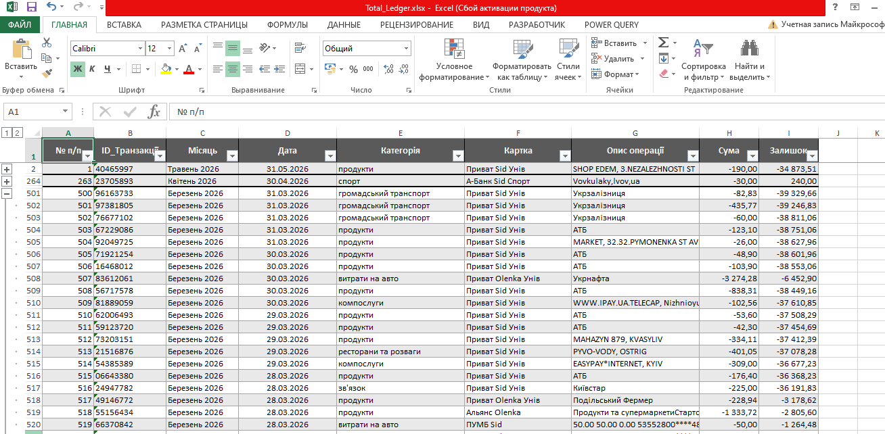 |
| *Неструктуровані PDF/Excel із різних банків (Monobank, ПриватБанк, ПУМБ)* | *Стандартизована база з MD5-хешами, усуненими дублікатами та автокатегоризацією* |

---

### 📥 Мультибанківський парсинг сирих виписок (Multi-Bank Parsing Engine)
Система побудована на базі абстрактного класу `BaseParser`, що визначає єдиний життєвий цикл парсингу для будь-якого банку (зчитування ➔ ідентифікація ➔ стандартизація ➔ коригування). Для кожного типу виписки реалізовано індивідуальну логіку:

*   **🟢 PrivatParser (Excel)** — динамічно зіставляє та зчитує змінні колонки ПриватБанку, визначаючи тип картки за метаданими.
*   **🟨 MonoParser (PDF)** — вилучає таблиці транзакцій, автоматично розпізнає IBAN та коригує кредитний ліміт із шапки файлу.
*   **🔵 PumbParser (PDF)** — інтелектуально склеює багаторядкові описи транзакцій (які часто розриваються при експорті з ПУМБ) та відновлює точний час операцій.
*   **🟪 AllianceParser (PDF)** — використовує регулярні вирази для миттєвого пошуку 4-значного хвоста картки в технічному тексті виписки.
*   **🟧 AbankParser (PDF)** — динамічно визначає IBAN у заголовку виписки та примусово закріплює відповідну карту за всіма транзакціями у файлі.

---

### 🔄 Фаза ETL: Налаштування, Очищення та Підготовка DataFrame

Перед застосуванням фінансової аналітики вся інформація проходить через наскрізний ETL-конвеєр (Extract, Transform, Load), який перетворює сирі та розрізнені виписки в єдиний стандартизований масив даних.

#### 1. Уніфікація структури та числових показників
*   **Єдиний стандарт колонок (Schema)**: Кожен зчитаний файл приводиться до суворої структури: `ID_Транзакції`, `Дата`, `Категорія`, `Картка`, `Опис операції`, `Сума` та `Залишок`.
*   **Трансформація типів (Float Normalization)**: Через функцію `clean_and_transform` усі суми та баланси очищуються від розділювачів тисяч (пробілів), коми автоматично замінюються на крапки, а технічні символи валют відсікаються регулярним виразом `(-?\d+\.?\d*)` перед конвертацією в числовий тип `float`.

#### 2. Інтелектуальна лінгвістична нормалізація описів (`_normalize_text`)
Перед класифікацією текст транзакції повністю очищується від технічного сміття:
*   Текст переводиться у нижній регістр, виконується заміна латинської літери `i` на українську `і` для уніфікації розкладки.
*   Усувається текстовий шум та слова-парази: `uah`, `грн`, `покупка`, `оплата`, `переказ`, `списання`.
*   Вирізаються всі випадкові технічні цифри (номери авторизацій, чеків), які заважають пошуку по ключах.
*   **Збереження контактів**: Номери телефонів у форматах `+380` тимчасово маскуються під маркер `plusua`. Це рятує їх від видалення на етапі чистки цифр і в кінці перетворює на надійний маркер `plus380` для авторозпізнавання поповнень мобільних.

#### 3. Векторизована генерація ID транзакцій (`make_short_id_vectorized`)
Оскільки банки не надають глобального ID, система створює стабільний та відтворюваний 8-значний ID самостійно:
1.  Формується унікальний рядок транзакції: `[Дата YYYY-MM-DD HH:MM:SS] + " *" + [Назва карти] + "* " + [Сума {:.2f}]`.
2.  Рядок кодується в MD5-хеш.
3.  Перші 8 символів хешу перетворюються з шістнадцяткової системи в десяткову за модулем $10^8$ із доповненням нулями зліва.

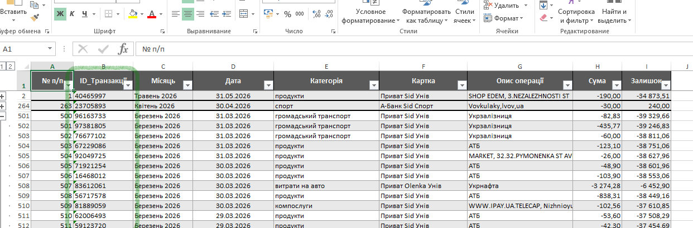

#### 4. Інкрементне злиття та дедуплікація (`reconcile_and_merge`)
*   Нові завантажені виписки можуть перекривати вже наявні періоди. Система розраховує ID для нових рядків і порівнює їх із базою `Total_Ledger.xlsx`.
*   Транзакції, які вже існують у базі, відсіюються як дублікати, а унікальні нові записи додаються.
*   Фінальний DataFrame примусово пересортовується в хронологічному порядку за датою та часом.

#### 5. Розрахунок залишків на картах
*   Виписки кредитних карток деяких банків у форматі PDF не містять поточного залишку для кожної транзакції.
*   Функція `apply_bank_specific_post_processing` виявляє картки таких банків і автоматично розраховує накопичувальний баланс для кожної операції на основі відомого стартового або фінального балансу виписки та сум транзакцій.

#### 6. Автодетекція рахунків та лімітів
*   **Детектор рахунків (`detect_account_identity`)**: Зчитує метадані виписки і за жорсткою ієрархією (IBAN регулярним виразом `UA` + 27 цифр -> 4-значний хвіст карти) автоматично підставляє правильну назву картки та власника з конфігурації.

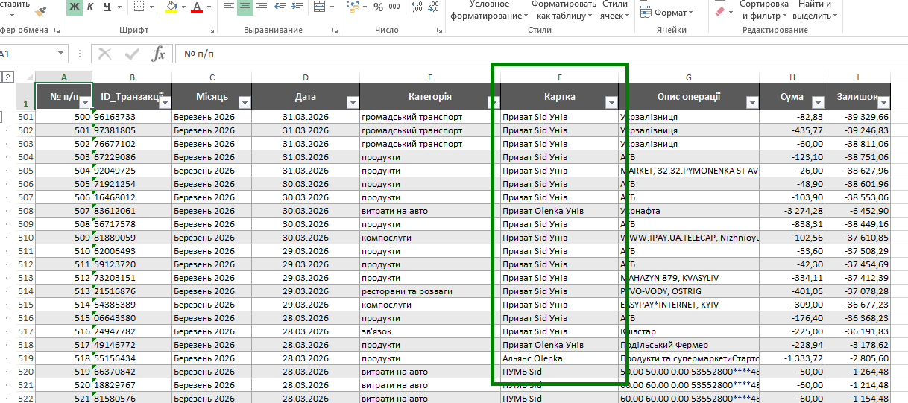

*   **Коригування лімітів**: При виявленні кредитного ліміту у виписках, система автоматично віднімає суму ліміту від залишку на карті. Це дозволяє уникнути викривлення показника Net Worth, відокремлюючи кредитні кошти банку від реальних.

#### 7. Дворежимна автокатегоризація ("Keyword First")

Щоб уникнути фінансового хаосу та появи дублюючих категорій-синонімів (наприклад, одночасного існування "продукти", "продовольчі товари" чи "супермаркети"), у системі жорстко зафіксовано **обмежений перелік цільових категорій** (6 для доходів та 17 для витрат). Усі операції примусово розподіляються виключно в межах цього списку за дворежимним алгоритмом "Keyword First":

1.  **Етап 1: Пошук за ключовими словами (`CATEGORIES_KEYWORDS`)** — очищений опис транзакції зіставляється з текстовими маркерами (наприклад, `атб` чи `сільпо` примусово маркуються як `продукти`).
2.  **Етап 2: Пошук за MCC-кодами (`MCC_MAP`)** — якщо ключових слів немає або транзакція неоднозначна (`AMBIGUOUS_CATEGORIES` на кшталт "оплата" чи "переказ"), категорія визначається за кодом Merchant Category Code торгової точки (наприклад, MCC `5411` -> `продукти`).
3.  **🛡️ Обробка нерозпізнаних транзакцій (Fallback Logic)**: 
    *   Якщо система не може визначити категорію для витрати (Сума < 0), транзакції автоматично присвоюється категорія **`інші витрати`**.
    *   Якщо не вдалося визначити категорію для доходу (Сума > 0), транзакція маркується як **`інші надходження`**.

---

### 📊 Аналітичне Ядро: Розподіл потоків та 3-рівневий Кліринг (Clearing & Analytics)

Після очищення та стандартизації масиву даних система запускає аналітичний двигун `report_engine.py` та фінансову логіку `finance_logic.py`, які виконують дві ключові задачі: розділення потоків даних та усунення «фінансового шуму».

#### 1. 📂 Структурування даних: Таблиці Доходів та Витрат
Для зручності аналізу та побудови звітів фінальна книга Excel розділяється на два незалежних хронологічних реєстри (листи), які працюють із суворо визначеними категоріями з `config.py`:

*   **🟢 Лист Доходів (Income Ledger)**: акумулює лише позитивні транзакції (Сума > 0). Сюди потрапляють 6 фіксованих категорій: *зарплата і виплати, бонуси та кешбек, поповнення готівкою, перекази з чужого рахунку, інші надходження* та технічна категорія *переказ з власного рахунку*.
*   **🔴 Лист Витрат (Expenses Ledger)**: містить усі операції списання (Сума < 0). Сюди входять 17 категорій витрат родини, згрупованих за типом (від регулярних *компослуг* та *продуктів* до технічного *зняття готівки* чи *переказів на власний рахунок*).

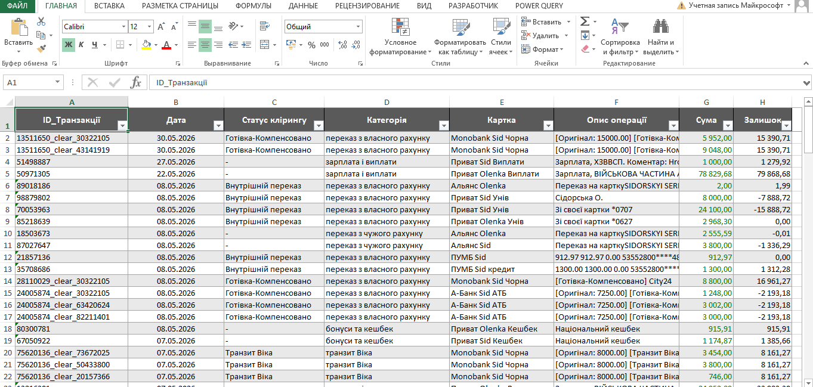

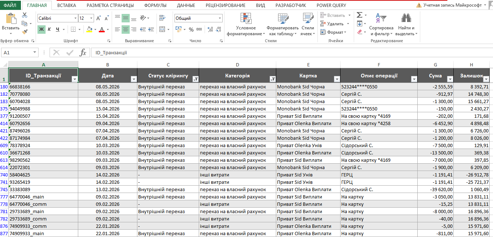

#### 2. 🛡️ Трирівнева система автоматичних компенсацій (The Clearing Engine)
Найбільша інженерна цінність проекту — це математичне моделювання реального руху грошей. Щоб виписки з різних карт не викривляли статистику реальних витрат сімейного бюджету, система автоматично гасить зустрічні транзакції на трьох рівнях:

##### 👥 Рівень 1: Внутрішні перекази між власними рахунками (Twins Algorithm)
Коли гроші переказуються між банківськими рахунками що вже зафіксовані в системі, наприклад, з картки Сергія на картку Оленки, для банків це дві окремі операції: витрата в одному банку та дохід в іншому. Якщо врахувати їх «як є», обіг сімейного бюджету штучно роздується на цю суму.
*   **Як це вирішено**: Алгоритм "Twins" аналізує протилежні транзакції у короткому часовому вікні. Якщо знайдено збіг (наприклад, Оленка отримала суму, яку Сергій щойно відправив), система маркує ці транзакції технічними категоріями *переказ на власний рахунок* / *переказ з власного рахунку*, виключаючи їх із одрахунків чистих споживчих витрат.
*   **🛠️ Проблема банківських комісій**: Часто перекази супроводжуються комісією (наприклад, Сергій відправив `10 050.00` грн, а Оленка отримала рівно `10 000.00` грн). Наївний алгоритм не зв'яже ці транзакції через різницю в сумах. 
    *   *Наше рішення*: Система виявляє розбіжність, автоматично розчіплює транзакцію, відокремлює `50.00` грн комісії, записує її в статтю *інші витрати*, а решту `10 000.00` грн успішно лінкує як чистий внутрішній переказ. Баланс леджера залишається ідеальним.

📄 БУЛО: Витратна транзакція на суму 3065,25 і дохідна на суму 3050,00 (комісія 15,25)| 📊 СТАЛО: Витратна транзакція розділилася на 2: 3050,00 - сума переказу, 15,25 - комісія банку |
| :---: | :---: |
| 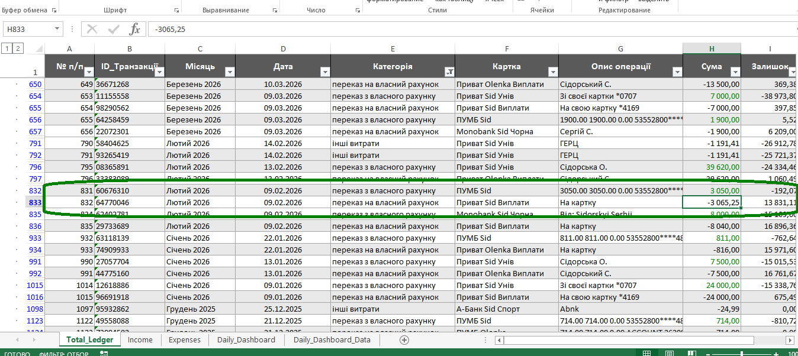 ! | 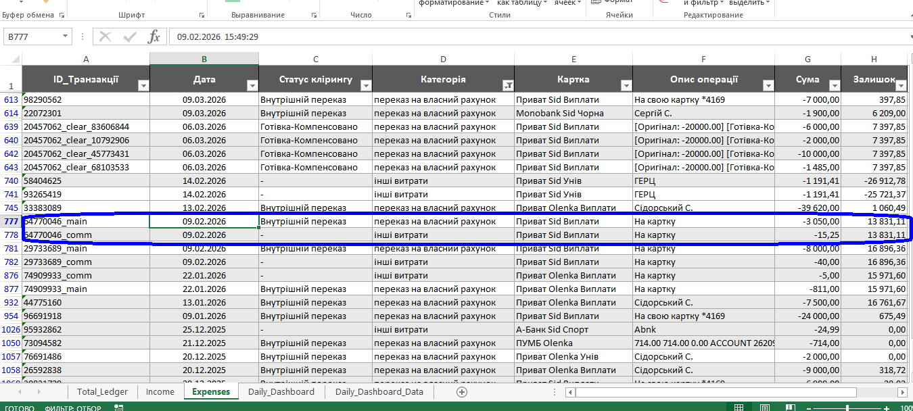 |
| *Оригінальні транзакції* | *Розчеплені транзакції (Зверніть увагу на ID)* |

### 3.2. Компенсація готівкових операцій (Cash Clearing & ATM-noise Reduction)

#### ❓ Бізнес-проблема
Зняття готівки в банкоматі та її подальше внесення через термінал на іншу картку не є реальними споживчими витратами чи доходами. Без спеціальної обробки ці операції створюють штучний транзитний оборот, роздуваючи показники доходів та витрат у фінансовій звітності.

#### ⚙️ Логіка роботи функції `process_cash_clearing`
Модуль `finance_logic.py` реалізує автоматичне взаємне гасіння готівкових потоків за правилом **Локального пріоритету (FIFO)**:

1. **Внутрішньомісячний FIFO-кліринг:** У межах кожного календарного місяця суми зняття та поповнення готівкою взаємно погашаються строго FIFO до ліміту.
2. **Міжмісячний транзит (до 10-го числа):** Якщо у місяці наявні невикористані поповнення (здійснені до 10-го числа включно), вони спрямовуються на компенсацію залишків зняття з попереднього місяця.
3. **Динамічне розщеплення на межі:** Транзакція, що потрапляє на межу компенсаційного ліміту, автоматично розщеплюється на два або більше окремих рядків зі спільним часом та ID.
4. **Перерозподіл некомпенсованих залишків:** Обсяги зняття понад ліміт перекатегоризовуються в *`інші витрати`*, а залишкові поповнення — в *`інші надходження`*.
5. **Принцип Raw Data First:** Усі маніпуляції виконуються «на льоту» під час формування аналітичного `df_analytical` для Daily Dashboard, залишаючи первинний реєстр `Total_Ledger.xlsx` 100% незмінним.

#### 📸 Візуальна демонстрація клірингу

| 📄 БУЛО: Сирі транзакції зняття/поповнення | 📊 СТАЛО: Результат після `process_cash_clearing` |
| :---: | :---: |
| 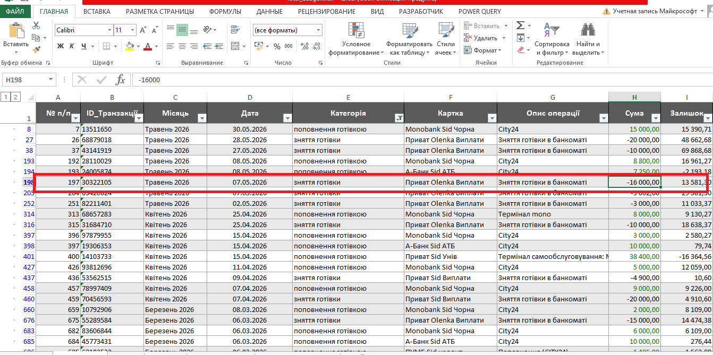 | 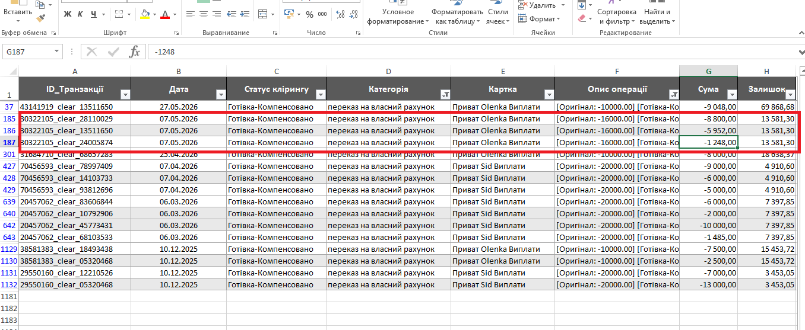 |
| *Транзакція зняття готівки на суму 16000,00* | *Розподіл цих коштів (16000,00) по прихідним транзакціям. Транзитний оборот погашено, залишкові суми ре-категоризовано* |

##### 🚀 Рівень 3: Транзитні операції та категорія "Інвестиції"
*   **Транзитні операції**: Логіка відстежує цільове переміщення коштів через транзитні рахунки (наприклад, депозити, накопичувальні «банки» або тимчасові сейфи).
*   **Логіка «Інвестицій»**: Будь-який великий вихідний транзитний потік (наприклад, купівля валюти, переказ на брокерський рахунок чи купівля облігацій) система не вважає повсякденною витратою (як-от купівля їжі чи одягу). Такі транзакції проходять через спеціальний фільтр і примусово класифікуються як **`інвестиції`** (активи). Це дозволяє зберегти правильний показник щомісячного споживання (Burn Rate) та обчислювати реальний Net Worth сімейного капіталу.

---

### 📊 Модуль Аналітики та Візуальний Дашборд (`report_engine.py`)

Модуль щоденної аналітики трансформує консолідований масив транзакцій у наочний щоденний управлінський звіт за структурою класичного фінансового леджера. Результатом роботи є інтерактивна вкладка **Daily_Dashboard** у фінальному файлі `Total_Ledger.xlsx`.

#### 1. Структура Daily Dashboard
Таблиця щоденної аналітики автоматично агрегує фінансові потоки у розрізі календарних днів та порівнює фактичні витрати із плановими щоденними лімітами. Вона складається з 8 ключових колонок:
1.  **Місяць** — календарний місяць та рік (наприклад, Березень 2026).
2.  **Дата** — конкретний день у форматі DD.MM.YYYY.
3.  **План** — щоденний бюджетний ліміт, виділений на родину на цей день.
4.  **Витрати** — сумарні фактичні витрати за день (від'ємне значення або `0.00`).
5.  **Дохід** — сумарні фактичні надходження коштів за день.
6.  **Різниця за день** — чистий фінансовий результат дня відносно ліміту.
7.  **Різниця за місяць** — накопичувальний баланс економії чи перевитрат у межах поточного місяця.
8.  **Різниця загалом** — глобальна динаміка чистих активів (Net Worth) з урахуванням початкового балансу.

#### 2. Математичний апарат розрахунків
Для кожного календарного дня система виконує обчислення за такими математичними формулами:
*   **Різниця за день (Daily Budget Variance)**:
    $$\text{Різниця за день} = \text{План} + \text{Витрати} + \text{Дохід}$$
    *(Оскільки витрати мають від'ємний знак у DataFrame, сума автоматично вираховує різницю)*.
*   **Різниця за місяць (Monthly Cumulative Balance)**:
    Накопичувальний підсумок різниць за день у межах календарного місяця. Першого числа кожного місяця цей показник обнуляється, показуючи проміжний баланс сімейного бюджету на будь-який день:
    $$\text{Різниця за місяць}_{d} = \sum_{i=1}^{d} \text{Різниця за день}_{i}$$
*   **Різниця загалом (Net Worth / Cumulative Asset Balance)**:
    Наскрізний накопичувальний підсумок від самого початку ведення леджера, що показує реальний обсяг власних накопичень родини у реальному часі з урахуванням кредитних лімітів:
    $$\text{Різниця загалом}_{t} = \text{Початковий баланс} + \sum_{i=1}^{t} \text{Різниця за день}_{i}$$

#### 3. Групування деталей та Професійна стилізація (openpyxl)
*   **Рядки проміжних підсумків**: Після останнього дня кожного місяця система автоматично вставляє підсумковий рядок **"РАЗОМ за [Місяць YYYY]"**. У ньому колонки *План, Витрати* та *Дохід* сумуються, а *Різниця за місяць* та *Різниця загалом* фіксують фінальний стан на кінець місяця.
*   **Групування детальних рядків**: Для максимальної читабельності всі детальні транзакції дня приховані під кнопками групування Excel **"+"** прямо всередині відповідного календарного дня.
*   **Динамічна висота та автоперенесення**: Для описів детальних транзакцій увімкнено автоперенесення тексту (`wrap_text=True`), а висота рядка адаптується автоматично під об'єм тексту, запобігаючи обрізанню довгих назв операцій.
*   **Візуальний стиль**: Заголовки мають дворівневу структуру, підсумкові рядки виділяються жирним шрифтом та кольоровою заливкою, а колонки автоматично підбирають свою ширину за довжиною значень. Таблиця повністю оптимізована під горизонтальний альбомний друк (Landscape).

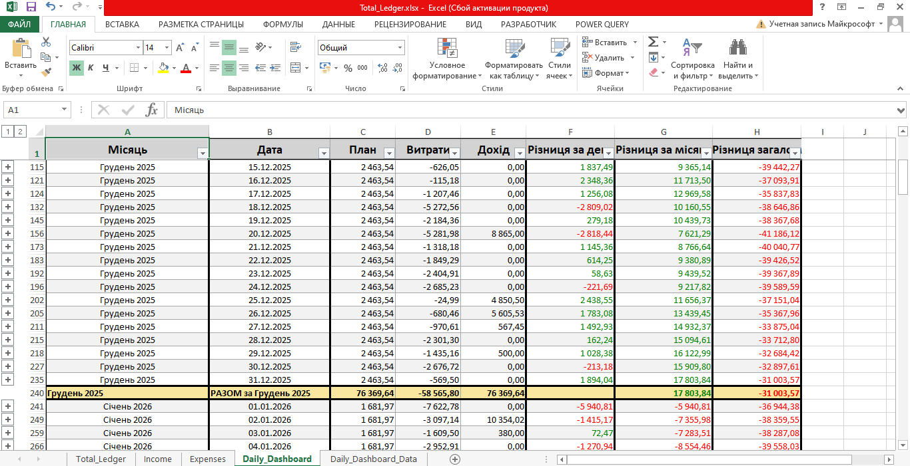

---

### 📈 Модуль Візуалізації та Інтерактивний Дашборд (`output/Dashboard.xlsx`)

Для наочного аналізу фінансових потоків реалізовано двофайлову архітектуру (**Decoupled Data & Presentation Layer**). Це розділяє автоматичну обробку даних Python та візуальну аналітику в Excel, забезпечуючи 100% збереження оформлення, кастомних зведених таблиць та слайсерів.

#### 🏗 Архітектура рішення:
1. **`output/Total_Ledger.xlsx` (Data Layer)** — локальна база даних (Data Lake / Marts), яка автоматично генерується та оновлюється Python-скриптом.
2. **`output/Dashboard.xlsx` (Presentation Layer)** — інтерактивний управлінський дашборд, що містить аналітичні панелі, графіки та зрізи.

#### 📊 Ключовий функціонал дашборду:
* **Картки показників (KPI Cards)**: фіксують ключові фінансові метрики (загальний дохід, витрати та поточний профіцит/дефіцит).
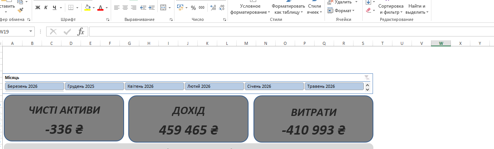
* **Динамічні зрізи (Slicers)**: інтерактивна фільтрація всіх графіків та карт за вибраними місяцями в один клік.
* **Ієрархічні діаграми (Drill-Down PivotCharts)**: дворічне групування дат (`Місяць` ➡️ `Дата`), що дозволяє переключатися між загальним місячним трендом та деталізацією по днях.

* **Пряме джерело даних (PivotTable External Data Source)**: зведені таблиці в `Dashboard.xlsx` прив'язані безпосередньо до колоночних діапазонів файлу `Total_Ledger.xlsx`. Завдяки цьому нові транзакції, оброблені Python, підтягуються на дашборд простою кнопкою **«Оновити все» (Data -> Refresh All)**.

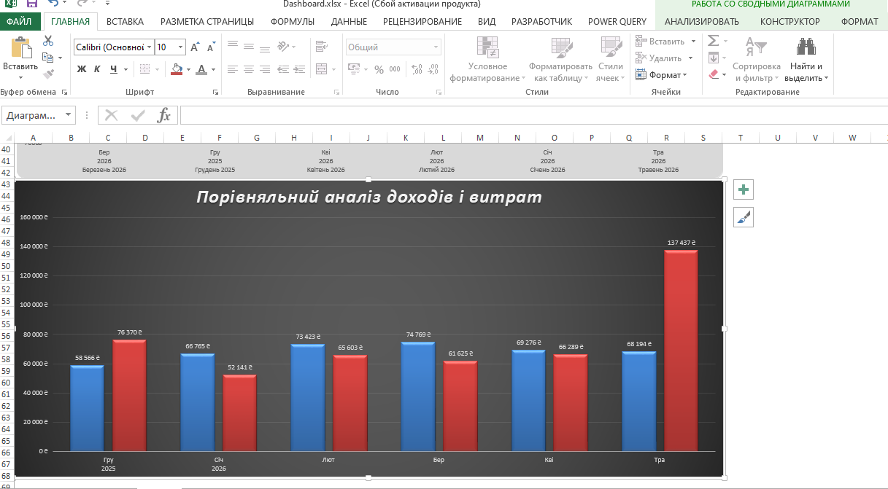

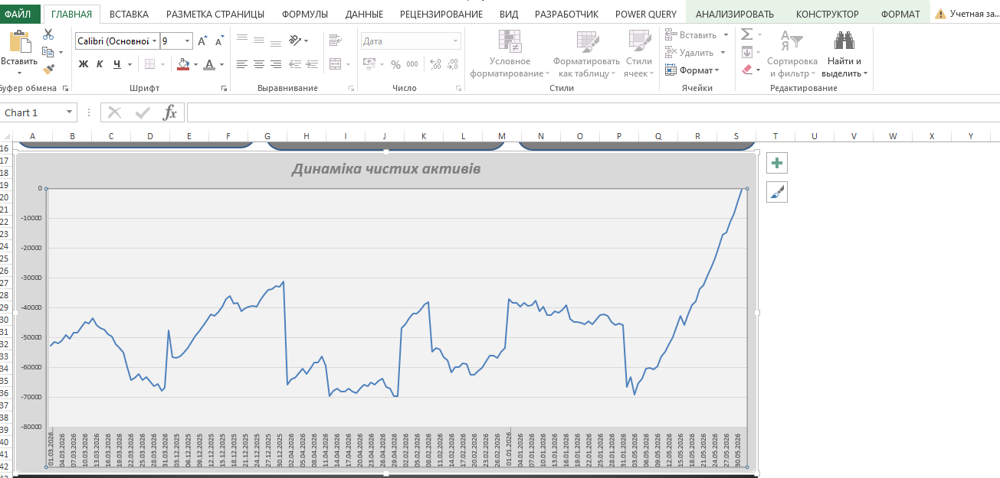

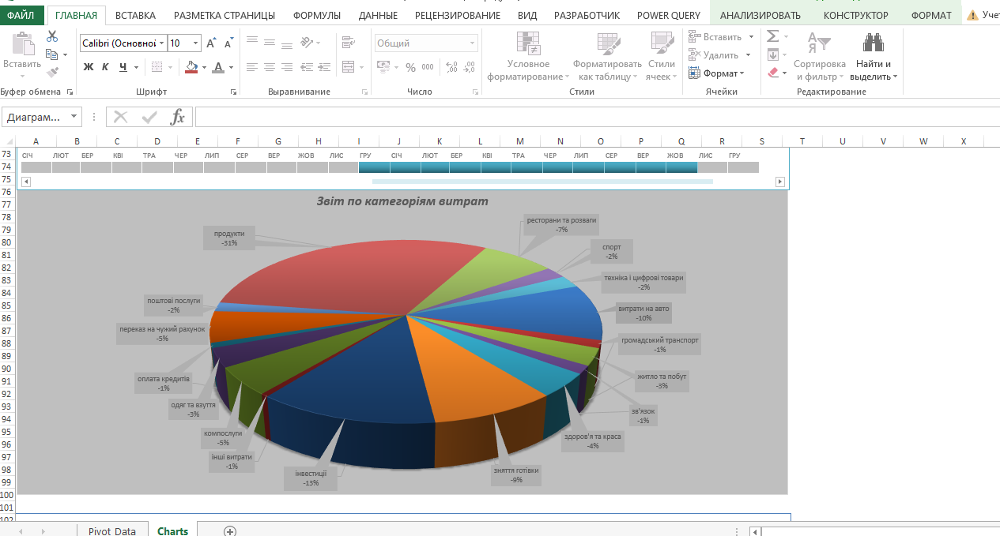

---

### 💼 Deliverables & Customization (Результати роботи)

Цей проект є повністю готовим і гнучким інженерним шаблоном сімейного або мікробізнес-офісу для консолідації та аналізу фінансових потоків.

#### Що отримує замовник як кінцевий результат (Deliverables):
1.  **🧼 Бездоганно чисті дані**: Повністю дедуплікований, хронологічно структурований та лінгвістично очищений реєстр усіх транзакцій у форматі Excel.
2.  **📊 Готову управлінську звітність**: Автоматично згенерований `Daily_Dashboard` із деталізацією, проміжними підсумками за місяць та розрахунком Net Worth.
3.  **🛡️ Безпеку даних**: Інструмент працює виключно локально — жоден байт ваших фінансових чи персональних даних не передається у хмару чи стороннім сервісам.

#### 🔧 Можливості кастомізації (Customization):
Система спроектована за принципами модульної архітектури, що дозволяє легко адаптувати її під індивідуальні вимоги.
*   **Інтеграція нових банків**: Швидке підключення виписок будь-яких фінансових установ світу (потрібно лише створити новий парсер на базі наявного `BaseParser`).
*   **Індивідуальна сітка категорій**: Повна кастомізація під структуру вашого особистого бюджету чи витрат бізнесу.
*   **Зміна бізнес-правил**: Гнучке налаштування алгоритму компенсацій близнюків, кредитних лімітів та лімітів щоденних витрат.

---

### 📞 Let's Connect! / Заклик до співпраці

Шукаєте надійне та автоматизоване рішення для аналізу ваших фінансів, очищення брудних даних або автоматизації бізнес-звітів в Excel? Я готовий допомогти вам реалізувати проект будь-якої складності!

*   **💻 Upwork Profile:** [Замовити розробку на Upwork](https://upwork.com/freelancers/your-profile)
*   **🤝 LinkedIn:** [Зв'язатися в LinkedIn]
*   **📧 Email:** [sid78rivne@gmail.com]
*   **🐙 GitHub:** [https://github.com/Serhii-Sid].

